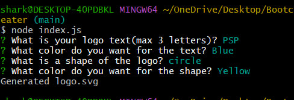

# SVG-Logo_Creator
Back end program to create SVG logo 

## Description

I wanted to create a application to create a logo. I wanted to add functunallity to ask question the user about the logo, and print logo depending what user imput was added. Also I wanted to add test function to app, if someone wanted to add some functunallyties he can run test to check if app still working.
## Table of Contets

- [Screenshots](#screenshots)
- [Links](#links)

## Screenshots

In this section I provided screenshots of the  Application.

## Links

In this section I added links to the deployed video and to the GitHub repositories with the original codebase.

Link to video with app usage 
    https://www.youtube.com/watch?v=nbLaHPxpWGM

Project Repository
    https://github.com/MykhailoZakh/SVG-Logo_Creator